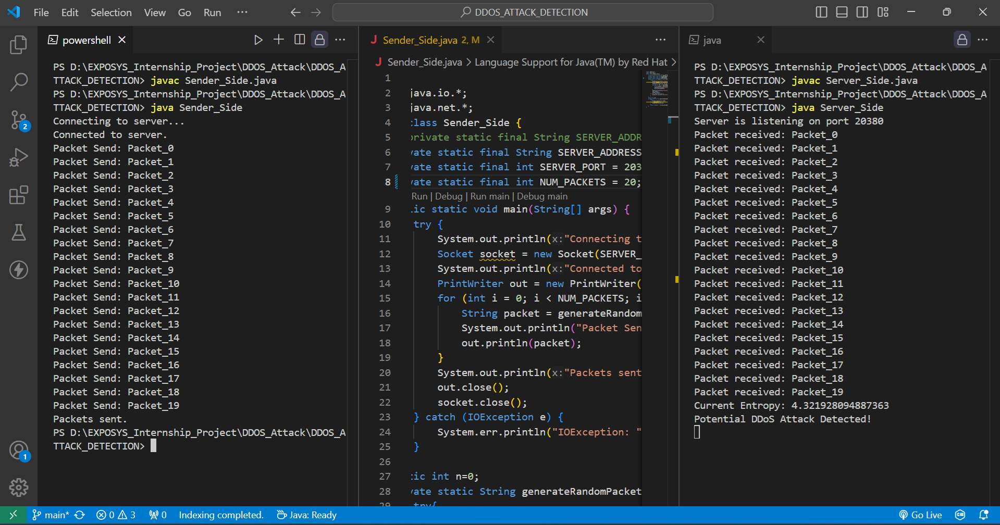

# Distributed Denial of Service (DDoS) Attack Detection Using Entropy Computing

## Overview

The Distributed Denial of Service (DDoS) attack is a significant threat to internet servers. It occurs when a large number of users simultaneously access a target, overwhelming the server and causing disruptions. Detecting such attacks can be challenging due to their nature and scale.

This project aims to identify DDoS attacks using entropy computing .

## Table of Contents

- [Overview](#overview)
- [Features](#features)
- [Installation](#installation)
- [Usage](#usage)
- [Screenshots](#screenshots)

## Features

- Sends Packets to server.
- Server get Packets and DDOS attack successfull.
- Detect DDoS attacks using entropy-based methods

## Installation

1. Clone the repository:
    ```sh
    git clone https://github.com/68rajat68/ddos-attack-detection.git
    ```
2. Change to the project directory:
    ```sh
    cd ddos-attack-detection
    ```
3. Install the required dependencies:
    ```sh
    pip install -r requirements.txt
    ```

## Usage

1. Start server_side code.
2. Then run Sender_side code.
3. View the results(as DDOS attack is perfomed or not).


## Screenshots




